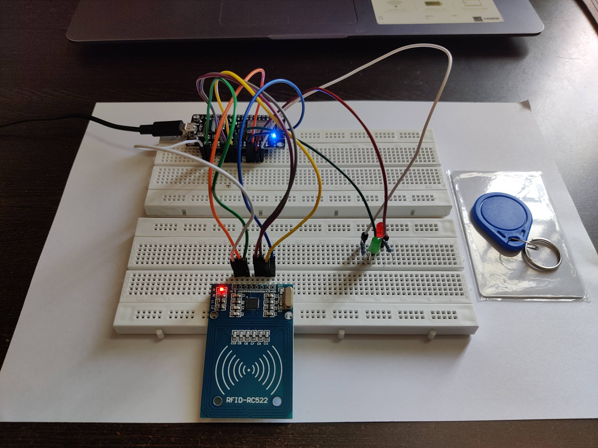
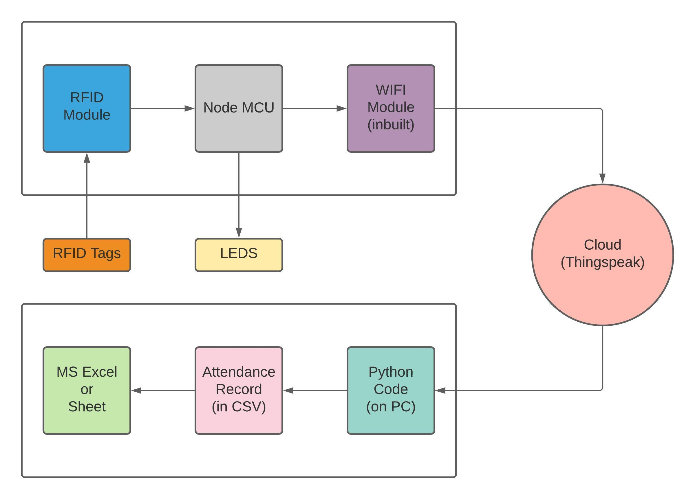
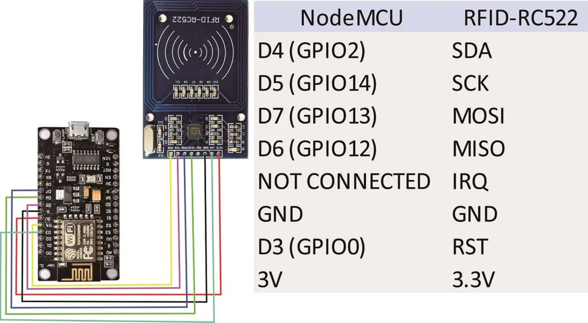
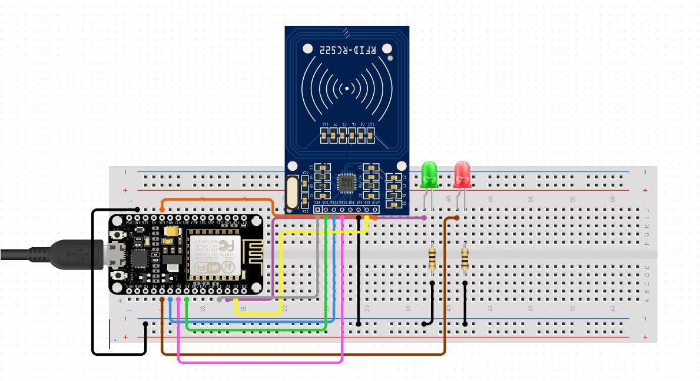

# RFID-based-Attendance-System

  

> An efficient and automated attendance management system based on RFID technology, which removes the need for manual attendance.

## Our Project Outcome




## Things needed for the project

- [x] Node MCU
- [x] RFID Module
- [x] 2 RFID Tags
- [x] 2 LED(one red and one green)
- [x] 2 Resistor(220 ohms)
- [x] Jumper Wire
- [x] Breadboard
- [x] Thingspeak ID

Extras:
- [x] PC
- [x] WiFi Router
- [x] USB to micro USB cable


## Block Diagram




## Connection Diagram

- connect RED LED to D2
- connect GREEN LED to D1



Thanks to [miliohm](https://www.youtube.com/channel/UCmpic0ZzBNzD1W0dTBqfQLQ) for [How to use RFID Reader with NodeMCU - RC522 RFID Reader Tutorial](https://www.youtube.com/watch?v=SQIGilMagm0) video 




## Prerequisite Knowledge

1. Basics of Python 
2. Basics of C++ (for Arduino Programming)
3. Basics of electrical circuit 
4. Basics of Thingspeak


## Instructions to run Arduino code

Install the following pakages :
- SPI
- MFRC522
- ThingSpeak
- ESP8266WiFi

Fill the following things in the code
```cpp
#define SECRET_SSID "Wifi Name"
#define SECRET_PASS "Wifi Password"
#define SECRET_CH_ID 0 // Channel ID here
#define SECRET_WRITE_APIKEY "Write API Key"
```


## Instructions to run Python code

Run in terminal :
```zsh
pip install thingspeak
```

Create a file name apikey.py in same folder as code.py :
```python
my_channel_id =  0 # channel id here 
my_write_api_key = "Write API Key"
my_read_api_key = "Read API Key"
```

Run in terminal :
```zsh
python code.py
```
---
Made with :heart: at IIIT Naya Raipur.
